To implement continious integration Configuring build matrices is necessary

## STEP 1: Matrix Build

* Implementing the matrix buld to tes across multiple versions or environment

  adding the matrix into the test workflow using the code below :

        strategy:
        matrix:
            node-version: [12.x, 14.x, 16.x]
            # This matrix will run the job multiple times, once for each specified Node.js version (12.x, 14.x, 16.x).
            # The job will be executed separately for each version, ensuring compatibility across these versions.
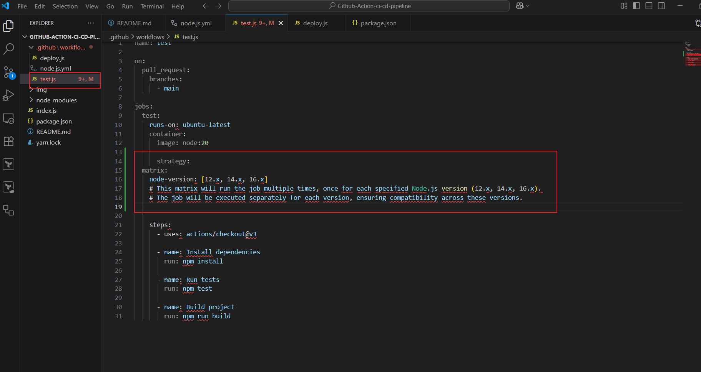

afterwhich I push to the remote repository using the commands:

            git add .
            git commit -m "matrix build"
            git push origin main
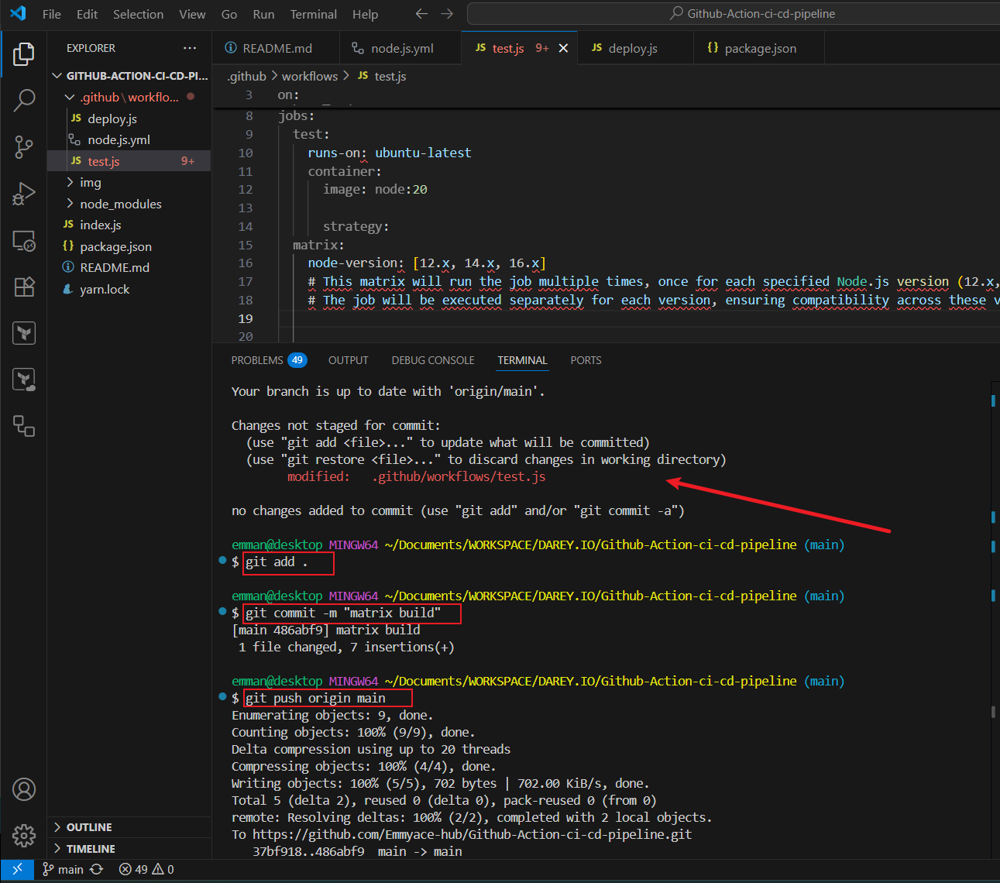

we can see it was successful by verifying on the workflow as shown below
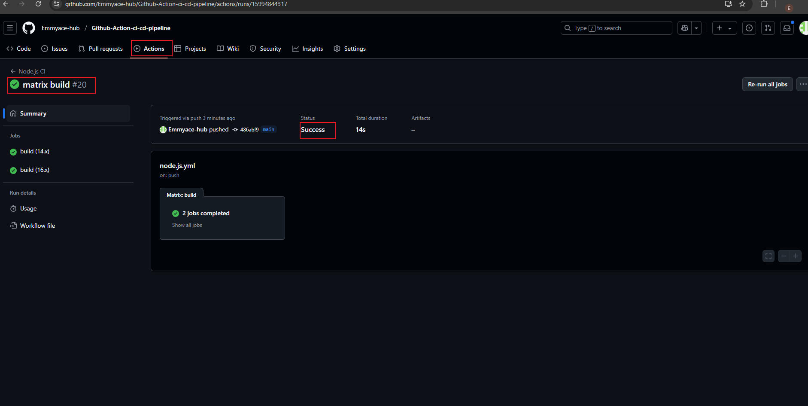

## STEP 2: Managing dependencies
* This is the utilization of cache to reduce time spent on downloading and installing dependencies repeatedly
add the code below into the test workflow and push to the remote registry 
 
        - name: Cache Node Modules
        uses: actions/cache@v2
        with:
            path: ~/.npm
            key: ${{" runner.os "}}-node-${{" hashFiles('**/package-lock.json') "}}
            restore-keys: |
            ${{" runner.os "}}-node-
        # This snippet caches the installed node modules based on the hash of the 'package-lock.json' file.
        # It helps in speeding up the installation process by reusing the cached modules when the 'package-lock.json' file hasn't changed.

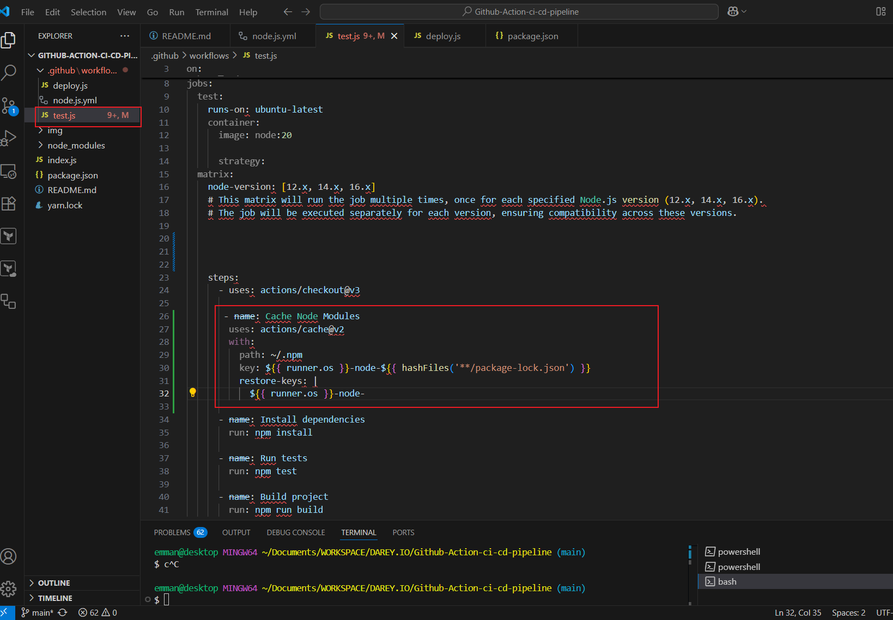
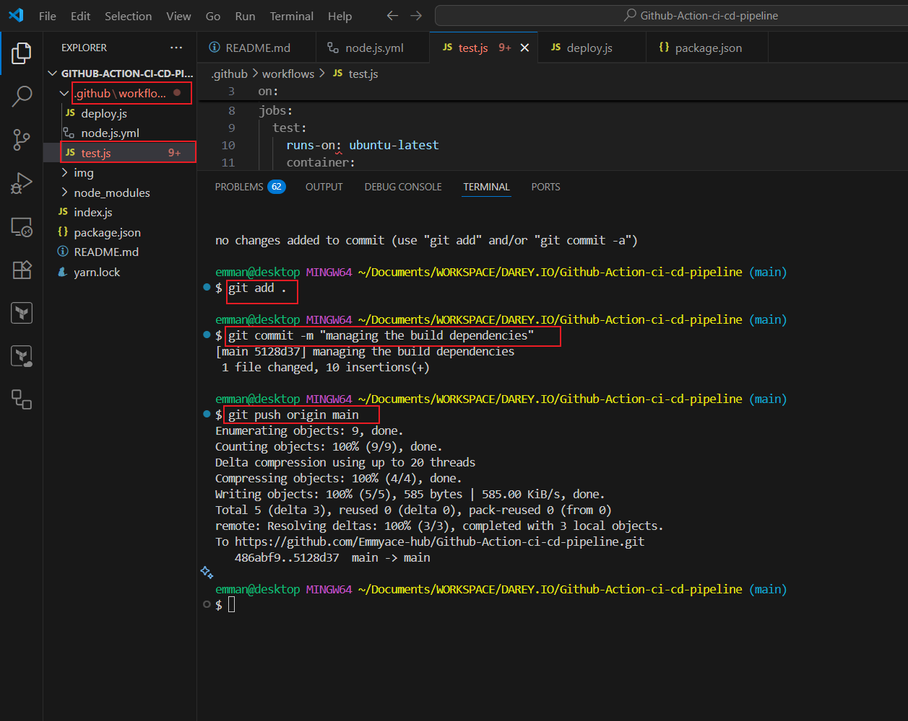
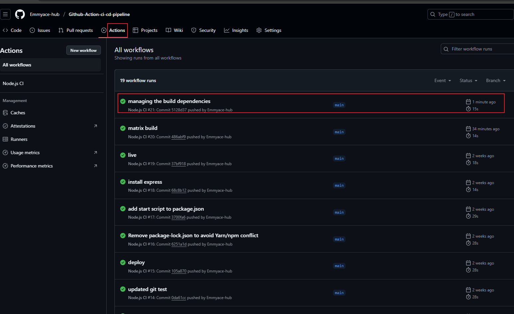

## STEP 3: Integrating code quality checks

* Adding code analysis tools into the workflow to analyse code quality and adherence to coding standards using the snipet below:

        - name: Run Linter
        run: npx eslint .
        # 'npx eslint .' runs the ESLint tool on all the files in your repository.

afterwhich we upload into the remote repository and also verify it was integrated to the workflow successfully

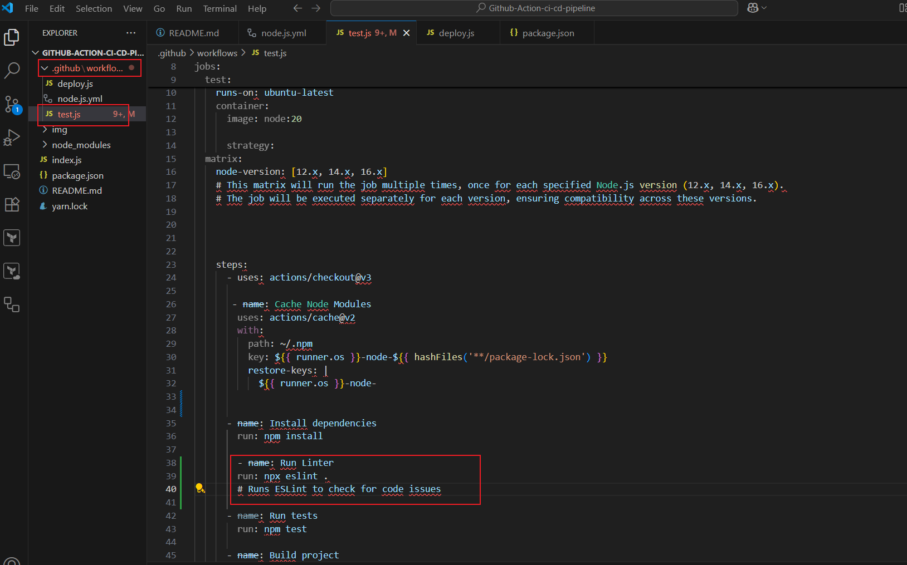
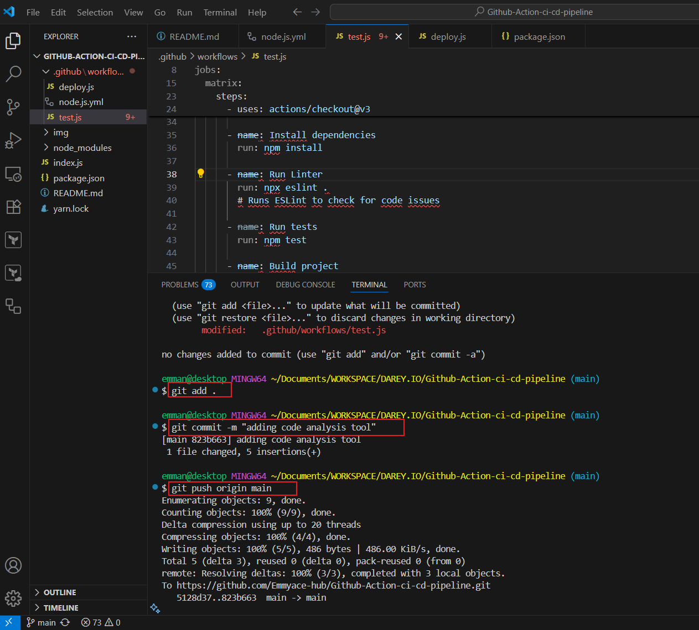
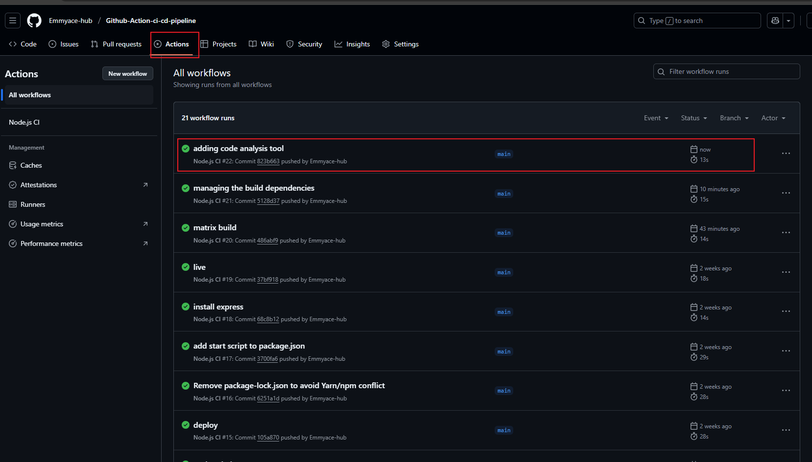

* Configuring linters and static code analyser to ensure the repository includes configuration files for the tools such as '.eslintrc' for ESLint:

        module.exports = {
        extends: "eslint:recommended",
        env: {
            browser: true,
            node: true,
            es2021: true
        },
        parserOptions: {
            ecmaVersion: 12,
            sourceType: "module"
        },
        rules: {
            // Add custom rules here
            "no-console": "warn",
            "semi": ["error", "always"]
        }
        };

### note:ESLint is a static code analysis tool used to identify problematic patterns in JavaScript code.

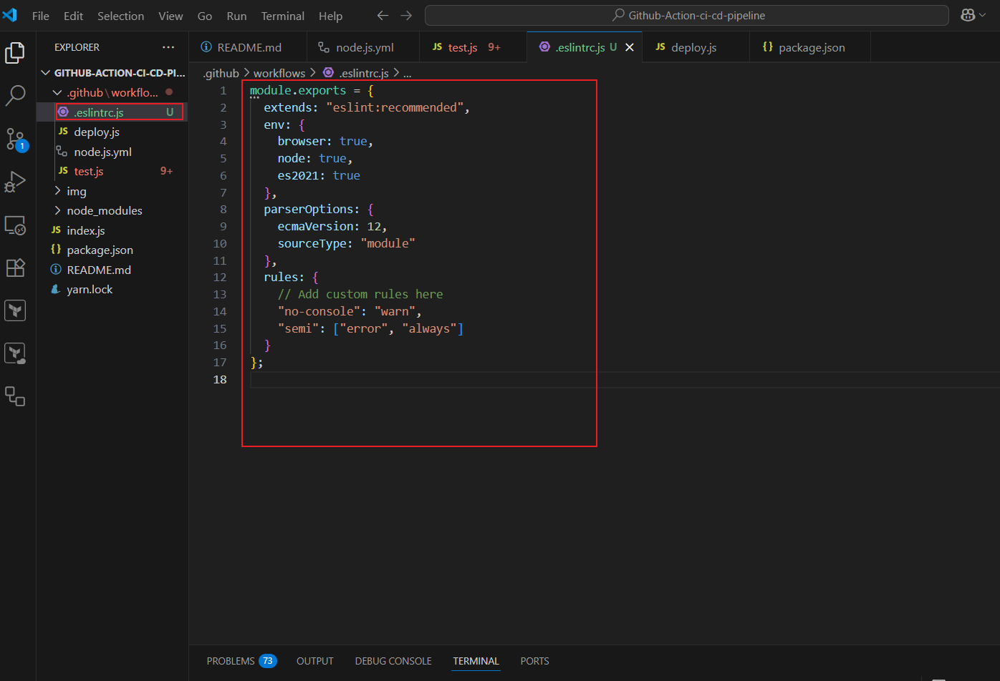
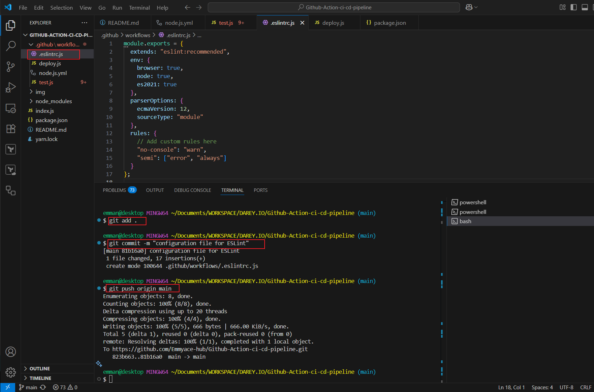
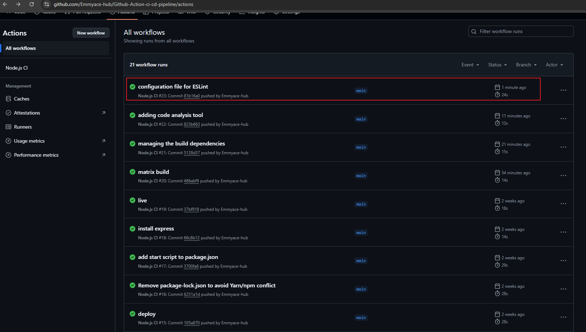  

